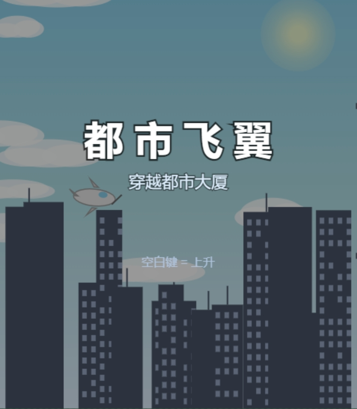

# 都市飞翼

[English](README_en.md) | 中文

---

AI生成的游戏

一款以都市大厦为背景的 Flappy Bird 风格休闲游戏。驾驶飞机穿梭于摩天大楼之间，挑战你的飞行技术。

## 游戏玩法

- **操作方式**：按 `空格键` 控制飞机上升，松开后飞机受重力自然下落
- **游戏目标**：穿越尽可能多的大楼间隙，获得更高分数
- **失败条件**：撞击大楼、触碰地面或飞出屏幕顶部

## 游戏特色

- 都市天际线背景
- 飞机尾焰与碰撞粒子特效
- 难度递增机制
- 本地最高分记录

## 运行方式

- **网页版**：直接用浏览器打开项目根目录的 `index.html` 即可游玩，无需安装任何依赖。
- **APK 版（Android）**：项目提供 `android-app` 工程，可打包为 APK 在 Android 设备上运行。
  [apk安装包](https://github.com/wqzh/FlappyPlane/releases/latest)